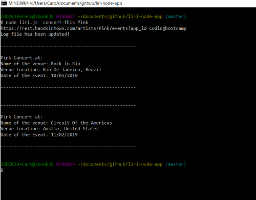
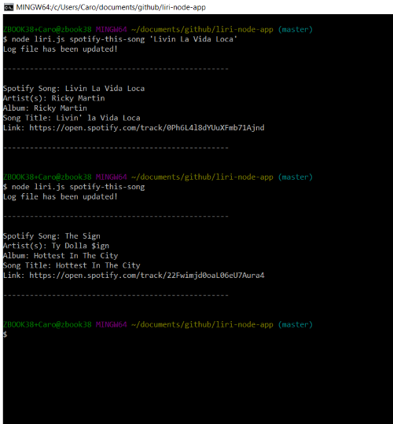

LIRI NODE APP

Author: Carolina(Caro) Berry

Feel free to use some or all of this code if you're trying to complete a similar project.

Project overview
LIRI is a command line Node app that takes in parameters and returns data from the following APIs: Bandsintown, Spotify and OMDb.
How it works
Type into the command line....

node liri.js concert-this "artist/band name here" to return concert information from Bandsintown.

node liri.js spotify-this-song "song name here" to return song information from Spotify. If no song is entered, a hard coded default song will return.

node liri.js movie-this "movie name here" to return movie information from OMDb. If no movie is entered, a hard coded default movie will return.

node liri.js do-what-it-says to return information stored in random.txt

Technology and packages used

- Node.js

- axious

- fs

- Bandsintown API

- OMDb API

- Spotify API

Below is a thorough, but not comprehensive, step-by-step process of how I got the app running in terms of code
Navigate to root of project. Initialize package.json by running npm init -y

Creation of .gitignore file

Creation of keys.js

Spotify keys for export
Creation of .env file to store Spotify API keys

Creation of random.txt with default result for do-what-it-says command

Creation of liri.js

npm install dotenv

npm install axious

npm install node-spotify-api

declare command line variables (command, parameter, queryUrl,file)

switchCase(); switch statement holding:

bandsintown();

spotifySearch()

onmb();

doWhatitSays();

call start() to run the program

- For bandsintown() the parameter will bring the artist (or band) on search and get the information through axios the info,
after finished with the function the log file is updated.

- For spotifySearch() the parameter is the song on search, however is a song is not typed in then by default
will bring the info for "The Sign". After function is finished the log file is updated.

- For onmb() the parameter is the movie on search and if a movie is not typed in they by default will bring the infor for "Mr. Nobody". The function get the information through axious, after finished with the 
function the log file is updated.

- For doWhatitSays() it reads the random.txt file to get the command and parameter and call the function required.

